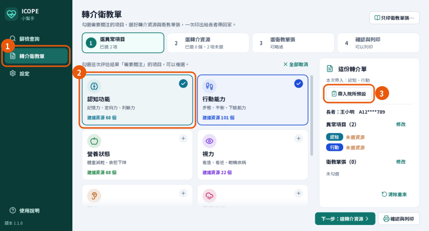
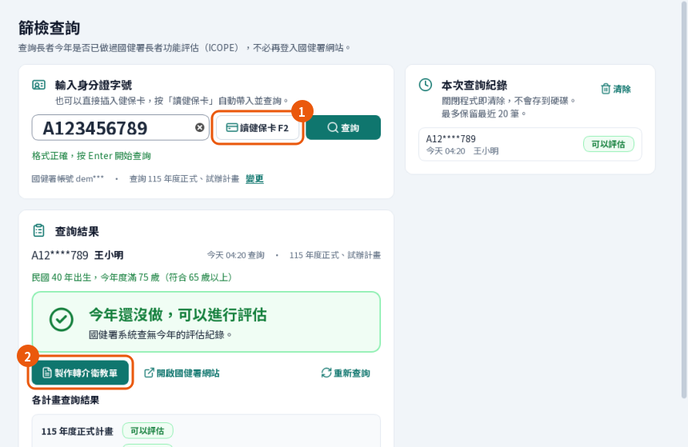
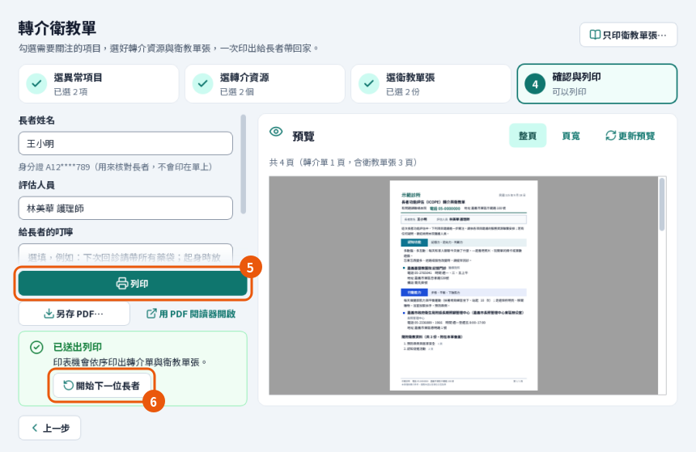
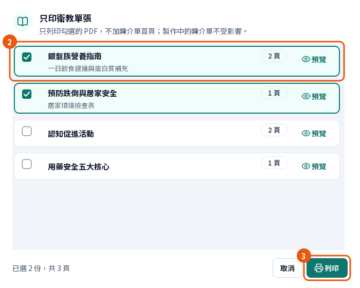
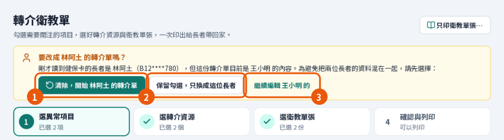

# ICOPE 小幫手（IcopeTool）

[](https://github.com/leon80148/icope_tool/actions/workflows/ci.yml)
[](https://github.com/leon80148/icope_tool/releases/latest)
[](LICENSE)

給診所與社區單位櫃檯用的 **Windows 桌面工具**，處理國健署長者功能評估（ICOPE）在現場最花時間的兩件事：

1. **這位長者今年能不能做 ICOPE？** 插健保卡或輸入身分證字號，幾秒內看到「今年還沒做，可以進行評估／今年已經做過評估／今年無法進行評估」，不必再登入國健署網站一筆一筆查。
2. **評估有異常，要轉介去哪、給什麼衛教？** 勾選異常項目，帶入院所事先設定好的轉介資源與衛教單張，印出一份給長者帶回家的 A4 轉介衛教單（大字、附衛教 PDF）。

> 這是診所自己開發的輔助工具，**不是國健署或任何政府機關的官方軟體**。查詢結果以國健署系統為準。



## 目錄

- [特色](#特色) · [畫面](#畫面) · [安裝](#安裝3-步驟) · [第一次使用](#第一次使用) · [功能總覽](#功能總覽)
- [資安與個資](#資安與個資) · [常見問題](#常見問題) · [開發](#開發) · [授權與第三方](#授權與第三方)

## 特色

- **日常最少 6 次點擊印出一份轉介衛教單**：院所把固定會給的資源與單張設為「院所預設」，日常只要勾項目 → 帶入院所預設 → 確認與列印 → 列印。預設只在按下按鈕時帶入，按鈕會先寫出這次帶入哪些項目，不會默默加東西。
- **查詢不必再開國健署網站**：自動登入、自動辨識驗證碼（辨識不出時請人工輸入）、正式與試辦計畫逐一列出、同一天查過的直接顯示。**帳號或密碼錯誤時只嘗試一次就暫停自動登入**，不會把院所的帳號鎖住。
- **讀健保卡，和 HIS 共用讀卡機**：共享模式讀卡、不重置卡片，不會打斷 HIS。讀卡時順便用卡上的出生日期核對年齡（以年度計，今年會滿 65 歲就算；未滿時提醒原住民 55 歲以上可評估）。
- **換長者會先問**：上一位的內容還沒清掉就讀到另一位，程式會請你選「清除重來／保留勾選／繼續編輯」，不會把兩位長者的內容混在一起。
- **每個環節都能依院所調整**：轉介資源庫（可從衛生局「社區資源盤點表」Excel 匯入）、衛教單張（自己的 PDF）、各項衛教重點（院所自己寫的一段話，印在該項目下方）、院所預設。整套設定可以匯出成**設定包**分享給其他院所。
- **只想印衛教單張也可以**：不加首頁、不需要國健署帳號，不會動到做到一半的轉介單。
- **多台電腦共用一份資料**：把資料夾放在 NAS 或網路磁碟，櫃檯與診間看到同一份資源、單張與設定；每筆修改都是單筆、原子寫入，不會互相蓋掉。
- **個資留在院內**：查詢紀錄與出生日期只在記憶體；稽核紀錄只記事件與身分證的雜湊碼；程式只連國健署系統，沒有任何回傳或統計。
- **內建圖文說明**：程式裡按 `F1`，16 張標了編號的畫面照著按就可以；最後有「卡住了怎麼辦」。

## 畫面

| 查詢今年能不能做 ICOPE（含年齡核對） | 最後一步：預覽、列印、開始下一位 |
|---|---|
|  |  |

| 只印衛教單張 | 換長者時先問清楚 |
|---|---|
|  |  |

圖片都是示範資料：診所與長者是虛構的，轉介資源是衛生局公開的嘉義市社區資源盤點表。完整的逐步畫面見 [圖文操作教學](docs/GUIDE.md)。

## 安裝（3 步驟）

需求：Windows 10 或 11（64 位元）、螢幕 1280×720 以上；查詢需要能上網，讀卡需要一般的晶片讀卡機。

1. 到 [Releases](https://github.com/leon80148/icope_tool/releases/latest) 下載 `IcopeTool-<版本>-win64.zip`。
2. 解壓縮到**可以寫入的資料夾**，例如 `D:\IcopeTool\`（不要放在 `C:\Program Files`）。
3. 雙擊 `IcopeTool.exe`。第一次執行若出現「Windows 已保護您的電腦」，按「其他資訊」→「仍要執行」。

不需要安裝 Python 或其他東西。每一步會看到什麼、多台電腦共用、更新、備份與移除，見 **[安裝與使用說明](docs/INSTALL.md)**（zip 裡也有一份）。

## 第一次使用

開啟後「篩檢查詢」上方會有一張設定清單，**用得到的再設定**：

| 想做的事 | 需要先設定 |
|---|---|
| 只印衛教單張 | 加入衛教單張（PDF）即可 |
| 印轉介衛教單 | 診所名稱電話、轉介資源、衛教單張；建議再設「院所預設」 |
| 查詢今年能不能做 | 國健署 hpdcs 的帳號密碼 |

想先試用：到「設定 › 轉介資源庫 › 匯入」選「嘉義市示範資料」。其他縣市請用衛生局的「社區資源盤點表」Excel，或下載程式裡的 Excel 範本自己填。照著圖做：**[圖文操作教學](docs/GUIDE.md)**。

## 功能總覽

- **篩檢查詢**：健保卡讀卡（`F2`）、身分證檢查碼驗證、驗證碼自動辨識、查詢可取消（`Esc`）、今天查過的結果直接顯示、正式與試辦計畫逐一列出、年齡核對、本次查詢紀錄（關閉程式即清除）。
- **轉介衛教單精靈**：8 個評估項目 → 各項目建議的轉介資源（常用置頂、依類型分組、可搜尋全部資源）→ 衛教單張（依項目標示「建議」）→ 預覽、列印（`Ctrl+P`）或另存 PDF。
- **院所預設與確認捷徑**：見上方特色；取消勾選項目時，它帶入的內容一起取消。
- **只印衛教單張**：勾選 PDF 直接列印；輸出前會重新核對檔案內容，別台電腦剛換過檔案時不會印出舊的。
- **各項衛教重點**：每個異常項目一段院所自己的文字（200 字、6 行以內）。
- **資源與單張管理**：Excel 匯入與範本、PDF 拖放加入、排序、停用、遺失檔案重新指定。
- **設定包**：資源庫與衛教單張（含院所預設標記）匯出成 zip；不含帳密、診所名稱電話地址與各項衛教重點。院所自己的清單也可以用 `tools/make_clinic_pack.py` 直接做成設定包。
- **自我檢測**：`IcopeTool.exe --self-test <資料夾>` 檢查字型、讀卡元件、PDF 產生與預覽、驗證碼辨識、說明圖片與主畫面，不連網。

## 資安與個資

公開原始碼的同時，把程式怎麼處理敏感資料講清楚：

- **國健署帳號密碼以明文存在資料存放位置的 `auth` 子資料夾。** 這是取捨後的設計：多台電腦要共用同一組帳密，Windows 的加密（DPAPI）無法讓別台電腦解開，而把金鑰放在同一個資料夾只是障眼法。真正的安全邊界是**資料夾的存取權限**——共用資料夾請只開放給院所同仁的 Windows 帳號。密碼不會出現在畫面、紀錄、錯誤訊息或設定包。
- **防鎖帳號**：登入失敗時，只有國健署明確回覆「驗證碼錯誤」才會重試；其他失敗（包含帳密錯誤）立刻停止並暫停自動登入，直到重新儲存帳密。
- **只連國健署系統**（`hpdcs.hpa.gov.tw`，HTTPS、驗證憑證）。沒有自動更新、不回傳使用統計（連驗證碼辨識元件 onnxruntime 內建的遙測事件也關掉了）、不連任何第三方服務。
- **個資不落地**：查詢紀錄、長者姓名、出生日期只在記憶體，關閉程式即清除；稽核紀錄（`%LOCALAPPDATA%\IcopeTool\logs\audit.log`）只記事件與身分證的 SHA-256 前 8 碼。
- **產生的 PDF**（含長者姓名）寫在本機暫存資料夾，超過一天自動清除，不放在共用資料夾。
- **匯入的檔案當成不可信任的輸入**：設定包不採用包內的檔名、匯入前檢查大小；共用資料夾裡的單張清單只接受單張資料夾內的 PDF 檔名。
- **下載檔的完整性**：每個版本的 Release 頁面附 SHA-256。exe 沒有程式碼簽章，所以第一次執行會出現 SmartScreen 提醒；請只從本頁的 Releases 下載。

發現安全問題請看 [SECURITY.md](SECURITY.md)。設計細節見 [docs/DESIGN.md](docs/DESIGN.md) 的「個資與安全」。

## 常見問題

**沒有讀卡機可以用嗎？** 可以，手動輸入身分證字號就能查詢；只是沒有出生日期，無法核對年齡，長者姓名也要自己填。

**沒有國健署帳號可以用嗎？** 可以。轉介衛教單與只印衛教單張都不需要帳號，只有篩檢查詢需要。

**不在嘉義市可以用嗎？** 可以。內建的示範資料只是範例；請匯入自己縣市衛生局的盤點表 Excel，或用 Excel 範本、逐筆新增。

**國健署網站改版了怎麼辦？** 程式發現畫面和預期不同會直接說明並請你改用網站查詢，不會亂猜結果。請到 [Issues](https://github.com/leon80148/icope_tool/issues) 回報。

**支援 macOS／Linux 嗎？** 發佈檔只有 Windows，測試也只在 Windows 上跑；讀卡與列印都以 Windows 為準。

## 開發

需求：Windows 10/11、Python 3.11。

```powershell
py -3.11 -m venv venv
venv\Scripts\python -m pip install -r requirements-dev.txt
# ddddocr 的套件宣告會拉進非 headless 的 opencv-python（與 PySide6 衝突），所以不裝它的依賴
venv\Scripts\python -m pip install --no-deps ddddocr==1.6.1
venv\Scripts\python -m pip install --no-deps -e .

venv\Scripts\python -m icope_tool              # 執行
venv\Scripts\python -m pytest                  # 測試（Qt 以 offscreen 執行，不連網、不需讀卡機）
venv\Scripts\python tools\guide_images.py      # 畫面改了：重新產生使用說明的圖片
venv\Scripts\python tools\ui_snapshots.py docs\ui-review\round-NN            # UI 審查截圖
venv\Scripts\python tools\make_clinic_pack.py 清單.json PDF資料夾 輸出.zip   # 把院所的清單與 PDF 做成設定包
powershell -ExecutionPolicy Bypass -File packaging\build_windows.ps1         # 測試＋打包成 zip
dist\IcopeTool\IcopeTool.exe --self-test out   # 在打包後的環境自我檢測
```

常用參數：`--data-dir <資料夾>` 指定資料存放位置、`--local-dir <資料夾>` 指定本機設定與紀錄位置（測試用，不會動到正式資料）。

### 專案結構

```
icope_tool/
├─ app.py、selftest.py        啟動流程、自我檢測
├─ store.py、models.py        JSON 資料層（原子寫入、單筆更新，適合共用資料夾）
├─ eligibility.py             年度年齡（65 歲／原住民 55 歲）
├─ services/
│  ├─ hpdcs/                  國健署登入與查詢（requests + ddddocr）
│  ├─ card/                   健保卡讀取（pyscard）
│  ├─ pdf/                    轉介單排版（fpdf2）與單張合併（pypdf）
│  └─ importer.py、pack.py     Excel 匯入、設定包
├─ resources/guide/           使用說明的圖片（tools/guide_images.py 產生）
└─ ui/                        PySide6 畫面（查詢、轉介精靈、設定、對話框、主題、使用說明）
tests/                        pytest 與 pytest-qt
tools/                        說明圖片、截圖、設定包、發佈說明等工具
packaging/                    PyInstaller spec 與打包腳本
docs/                         安裝說明、圖文教學、設計文件、hpdcs 協定紀錄、UI 審查紀錄
examples/                     嘉義市社區資源示範資料（271 筆）
```

設計取捨與資料模型見 [docs/DESIGN.md](docs/DESIGN.md)；國健署網站的登入與查詢協定見 [docs/hpdcs_protocol.md](docs/hpdcs_protocol.md)；版本差異見 [CHANGELOG.md](CHANGELOG.md)。

### 發佈新版本

1. 改版本號：`icope_tool/__init__.py` 的 `__version__` 與 `pyproject.toml` 的 `version`。
2. 在 `CHANGELOG.md` 最上面加 `## [x.y.z] - 日期` 一段（`tests/test_release.py` 會檢查這三處一致）。
3. 推到 `main`，等 CI 通過。想先試跑打包：GitHub 的 Actions › release › Run workflow（只建置與自我檢測，不發佈）。
4. `git tag vx.y.z && git push origin vx.y.z`。GitHub Actions 會在 Windows 上跑測試、打包、對 exe 自我檢測，通過才把 zip 與 SHA-256 發佈到 Releases；tag 和版本號不一致會直接失敗。

## 示範資料

`examples/chiayi-city-resources.json` 整理自嘉義市政府衛生局公開的「社區資源盤點表」，只供試用與示範；各單位的電話與服務內容請以該單位公告為準。

想看一份院所實際整理好的設定包（含衛教單張 PDF）：Releases 附有 [anchia-clinic-pack.zip](https://github.com/leon80148/icope_tool/releases/download/v1.1.1/anchia-clinic-pack.zip)（嘉義市一家基層診所的 15 筆轉介資源與 4 份衛教單張），用「設定 › 匯出／匯入 › 選擇設定包… › 合併」匯入，匯入後再自己設院所預設。

院所自己的清單（常含聯絡人姓名與手機）請放在 git 忽略的 `packs/`，不要放進 `examples/`——那個資料夾會跟著程式發佈給所有人；要分享時再決定是否附到 Release。

## 授權與第三方

本專案以 [MIT License](LICENSE) 釋出：可以自由使用、修改與再散佈，請保留著作權聲明；作者不負擔保責任。

- 字型：Noto Sans TC（SIL Open Font License 1.1，`icope_tool/services/pdf/fonts/OFL.txt`）。
- 圖示：Lucide（ISC License，`icope_tool/resources/icons/LICENSE-lucide.txt`）。
- PySide6／Qt（LGPL-3.0）以動態連結方式隨附，可自行替換發佈資料夾內的 Qt 程式庫。
- 驗證碼辨識：ddddocr 與 onnxruntime（MIT）。其餘相依套件見 `requirements.txt`。
