# ICOPE 小幫手　圖文操作教學

> 還沒安裝？先看[安裝與使用說明](INSTALL.md)（下載 zip、解壓縮、雙擊 `IcopeTool.exe`）。程式裡按 `F1` 會看到用同一批插圖的使用說明。圖上的**橘色編號**對應每張圖下方圖說裡的編號。
> 圖片用示範資料產生：診所與長者是虛構的，轉介資源是衛生局公開的嘉義市社區資源盤點表（`examples/`）。畫面改版時用 `tools/guide_images.py` 重新產生。

## 這是什麼

給診所護理師與櫃檯人員用的 Windows 桌面程式，做兩件事：查「這位長者今年能不能做 ICOPE」，以及把評估異常項目的**轉介資源**和**衛教單張**整理成一份 A4 的轉介衛教單（後面附上選好的衛教單張）印給長者帶回家。院所把固定會給的內容設為「院所預設」後，日常印一份只要 6 次點擊。

## 快速開始：印出第一份轉介衛教單

> 🎯 **目標**：印出一份含轉介資源與衛教單張的轉介衛教單：畫面出現綠色的「已送出列印」，並從印表機拿到紙本。
>
> ⏱️ **預計時間**：1 分鐘（已經設定好院所預設時）。

**開始前**：院所已經有轉介資源與衛教單張，並把常用的設為「院所預設」。還沒有的話先做[第一次設定](#第一次設定管理者做一次)；用[匯入設定包](#匯入設定包)的方式準備時，記得做完最後一步「確認院所預設」。

1. 在左邊按 **轉介衛教單**。右邊「這份轉介單」如果寫著「長者：○○○」，先確認就是眼前這位長者；沒有這一行表示還沒帶入長者，姓名到最後一步再填。
2. 勾選這位長者評估結果中**需要關注的項目**（可以複選）。你會看到卡片變色並打勾，右邊「這份轉介單」列出勾選的項目。
3. 按右邊的 **帶入院所預設**。按之前，按鈕上方會寫「本次帶入：認知、行動」告訴你會處理哪些項目；按之後，你會看到右邊清單出現帶入的轉介資源與衛教單張，下方跳出「已帶入 2 個轉介資源、2 份衛教單張」（數量依院所的設定而定）。

   

   *圖 1：① 轉介衛教單　② 勾選異常項目（圖中勾了認知、行動）　③ 帶入院所預設。*

   > 🧯 **沒有「帶入院所預設」按鈕？** 看按鈕位置的那幾行字：「可在設定把常用的資源與單張設為「院所預設」…」表示院所還沒設定；「○○目前沒有院所預設，可自行選擇」表示這個項目要自己選，見[調整內容](#調整這份轉介單的內容)；「已帶入過院所預設：…」表示已經帶入了。

4. 按右下角的 **確認與列印**。你會看到最後一步的畫面：左邊是長者姓名與叮嚀，右邊是整份文件的預覽。

   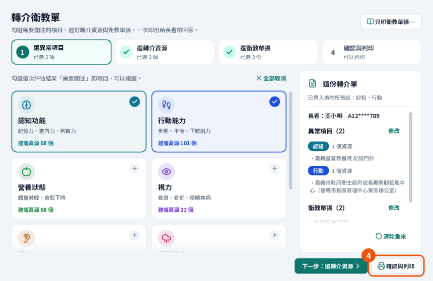

   *圖 2：右邊寫著「已帶入過院所預設：認知、行動」並列出內容。④ 確認與列印只會跳到最後一步，不會直接印。*

5. 核對**長者姓名**與右邊的**預覽**，按 **列印**（或 `Ctrl+P`），在系統的列印視窗選印表機後送出。你會看到綠色的「已送出列印」。
6. 到印表機拿紙本，核對姓名與頁數，再按 **開始下一位長者** 清除這份轉介單的內容（評估人員會保留）。

   

   *圖 3：⑤ 列印　⑥ 開始下一位長者。「已送出列印」表示文件已經交給印表機；預覽上方寫著總頁數（轉介單與衛教單張各幾頁）。也可以「另存 PDF…」或「用 PDF 閱讀器開啟」。*

> ✅ **最佳做法**：先在「篩檢查詢」讀健保卡，再按「製作轉介衛教單」——長者姓名會自動帶入，不必自己打字。

> ⚠️ **注意：換下一位長者時**。上一位的內容還沒清掉，就讀到另一位長者的健保卡（或從篩檢查詢帶入另一位），上方會出現黃色的「要改成 ○○ 的轉介單嗎？」。程式不會替你決定，請選一個：
>
> - ① **清除，開始 ○○ 的轉介單**：最常用。清掉上一位的勾選與叮嚀，從頭開始。
> - ② **保留勾選，只換成這位長者**：勾選的項目、資源、單張和「給長者的叮嚀」都會留著，只換長者。印之前要逐項重新核對。
> - ③ **繼續編輯 ○○ 的**：讀錯卡時用，這份轉介單維持原本那位長者。
>
> 
>
> *圖 4：① 清除，開始新長者的轉介單　② 保留勾選，只換成這位長者　③ 繼續編輯原本長者的。*

## 常見任務

### 只印衛教單張

1. 在「轉介衛教單」右上角按 **只印衛教單張…**。

   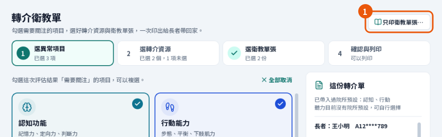

   *圖 5：① 只印衛教單張…。不需要國健署帳號，也不會動到做到一半的轉介單。*

2. 勾選要印的單張。你會看到左下顯示勾選的份數與總頁數，以圖中的勾選為例是「已選 2 份，共 3 頁」。
3. 按 **列印**，再選印表機。只會印出勾選的 PDF，不加轉介單首頁；送出後視窗會關閉，主畫面下方顯示「已依列印設定送出；所選文件共 2 份、3 頁」（份數與頁數依你的勾選而定）。

   

   *圖 6：② 勾選單張（可按「預覽」先看內容）　③ 列印。*

> 🛠️ **小技巧**：想要有診所資訊、長者姓名與叮嚀的首頁，改用轉介衛教單：不勾任何項目，直接按上方步驟列的 **3 選衛教單張** 勾選單張，再到「確認與列印」。

### 查詢長者今年能不能做 ICOPE

1. 到 **篩檢查詢**，把健保卡插入讀卡機後按 **讀健保卡**（或 `F2`）；也可以輸入身分證字號後按 `Enter`。
2. 幾秒後你會看到 **今年還沒做，可以進行評估**、**今年已經做過評估** 或 **今年無法進行評估**，下面列出各計畫的結果。
3. 讀健保卡查詢時，結果上方會多一行年齡核對，例如「民國 40 年出生，今年度滿 75 歲（符合 65 歲以上）」。年齡以年度計算：今年會滿 65 歲就算，不看生日過了沒。未滿 65 歲會用橘色字提醒（原住民 55 歲以上可評估，請確認身分）。手動輸入身分證沒有出生日期，會寫「未讀健保卡，無法核對年齡」。這一行只是提醒，能不能評估仍以國健署的結果為準。
4. 按 **製作轉介衛教單**，會帶著這位長者到轉介衛教單。

   

   *圖 7：① 讀健保卡　② 製作轉介衛教單。同一天重複查同一位長者會直接顯示暫存結果；要最新結果按「重新查詢」。*

### 調整這份轉介單的內容

項目沒有院所預設（右邊會寫「○○目前沒有院所預設，可自行選擇」），或這位長者需要不同的安排時：

1. 在第一步按 **下一步：選轉介資源**。
2. 在左邊選一個項目，勾選要列在轉介單上的服務。常用的排在最上面；找不到可以按「從資源庫加入…」搜尋全部資源。不需要轉介也可以不選，單上會請長者與醫護人員討論。

   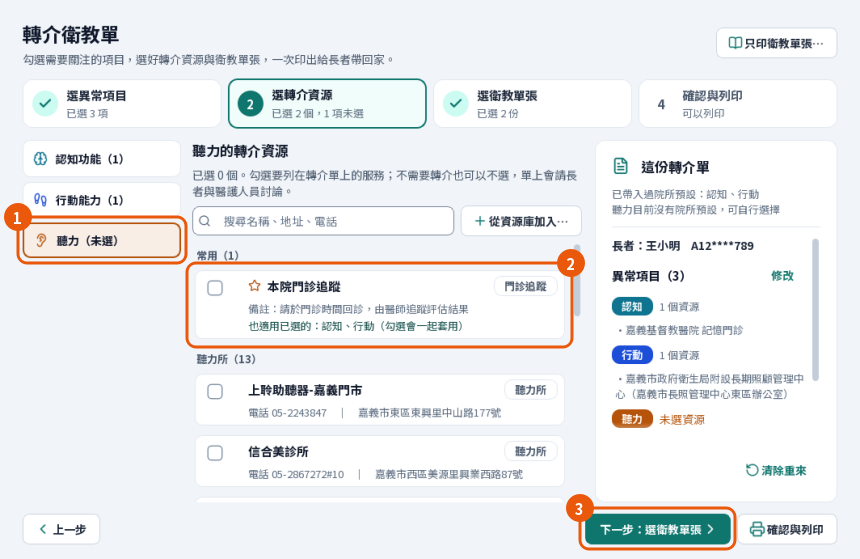

   *圖 8：① 選項目　② 勾選資源　③ 下一步：選衛教單張。資源列寫「也適用已選的：認知、行動（勾選會一起套用）」時，勾一次就會套用到那些項目，取消也一樣。*

3. 按 **下一步：選衛教單張**，勾選要一起印的單張。標著「建議」的是搭配已勾選項目的單張；「勾選所有建議的單張」可以一次勾好。
4. 按 **下一步：確認與列印**。你會看到右邊的預覽裡，每個項目底下列出剛才勾選的服務，最後附上勾選的單張；核對後列印。

   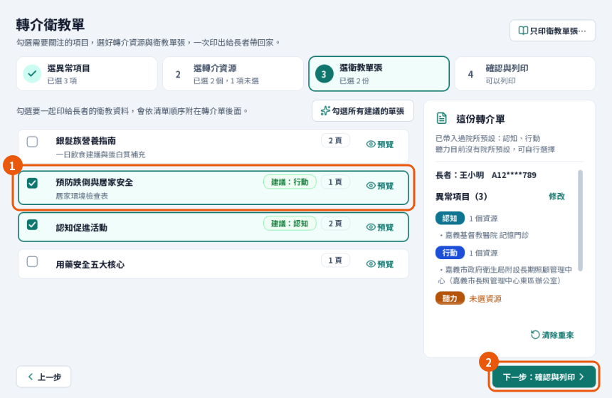

   *圖 9：① 勾選單張（會依清單順序附在轉介單後面）　② 下一步：確認與列印。*

> ⚠️ **注意**：取消勾選一個異常項目，這個項目的轉介資源會一起拿掉（同一份轉介單再勾回來會還原）。院所預設帶入的單張也會跟著拿掉——除非其他已勾選的項目也用到，或你自己勾選過那份單張。勾回來之後，院所預設要再按一次「帶入院所預設」。印之前看一下右邊「這份轉介單」的清單。

## 第一次設定（管理者做一次）

第一次開啟時，「篩檢查詢」上方會有一張清單，每一項右邊的按鈕會帶你到對應的設定。**用得到的再設定**：只印衛教單張不需要國健署帳號。

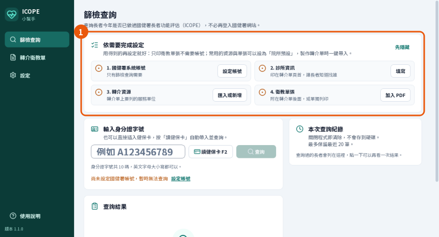

*圖 10：① 依需要完成設定。做完的項目會顯示「已完成」。*

### 診所與轉介單、各項衛教重點

1. 到 **設定 › 診所與轉介單**，填**診所名稱**（必填）、電話、地址。下面的「轉介單上會這樣顯示」會跟著變。
2. 在 **各項衛教重點** 選一個異常項目，寫一段給長者與家屬的話（選填，200 字、6 行以內）。這段文字會印在轉介單該項目的標題下方。
3. 按右下角的 **儲存**。你會看到「已儲存診所資訊與衛教重點」。項目選單裡的「（已填）」只表示那個項目有文字，看到這句才是存好了。

   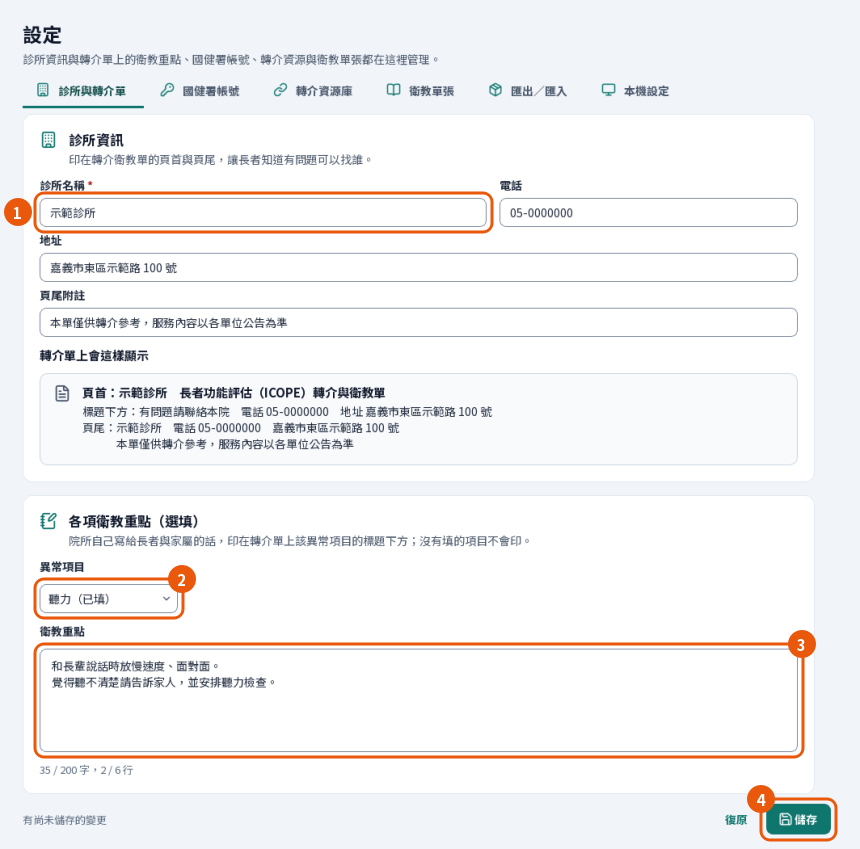

   *圖 11：① 診所名稱、電話、地址　② 選異常項目　③ 寫衛教重點　④ 儲存。文字框下方會顯示字數與行數；超過限制會變紅字，縮短後才能儲存。*

### 轉介資源與院所預設

1. 到 **設定 › 轉介資源庫**，按 **匯入**（衛生局「社區資源盤點表」Excel、範本或示範資料），或按「新增資源」。
2. 選取院所固定會轉介的單位（按住 `Ctrl` 可以複選）。
3. 按 **設為院所預設**。你會看到「預設」欄出現「預設」。

   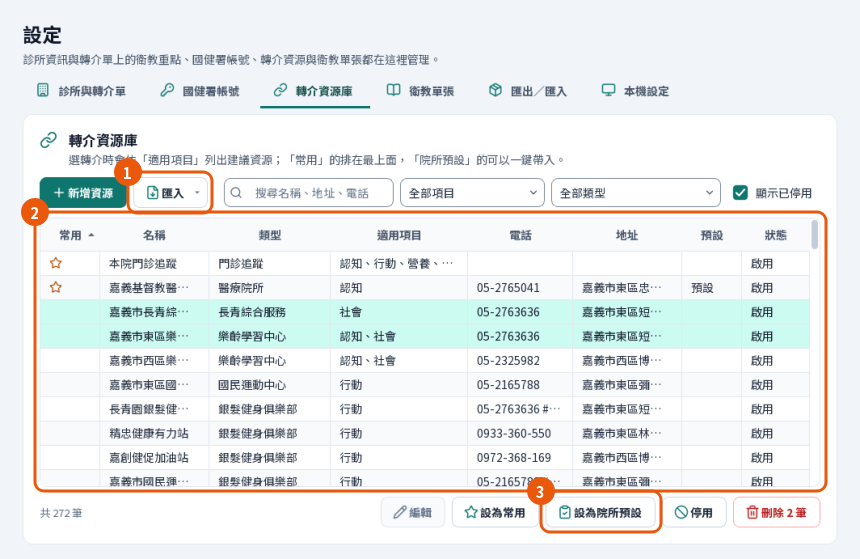

   *圖 12：① 匯入　② 選取資源　③ 設為院所預設。*

> ✅ **最佳做法**：「常用」（★）只是排在清單最上面；「院所預設」才會被「帶入院所預設」帶入。預設只留每個項目幾乎每次都會給的一兩個，其餘交給護理師在第二步選。

### 衛教單張

1. 到 **設定 › 衛教單張**，按 **加入 PDF…**（或把 PDF 拖進視窗）。
2. 一次加一份時會跳出「加入衛教單張」：填名稱，勾選**建議搭配的異常項目**，按「加入」。你會看到表格多了這份單張，下方跳出「已加入「○○」」。一次加很多份時會直接加入，之後在表格上逐份點兩下，補上名稱與建議搭配的項目。
3. 固定會給的單張，選取後按 **設為院所預設**。你會看到「預設」欄出現「預設」。「上移／下移」決定列印順序。

   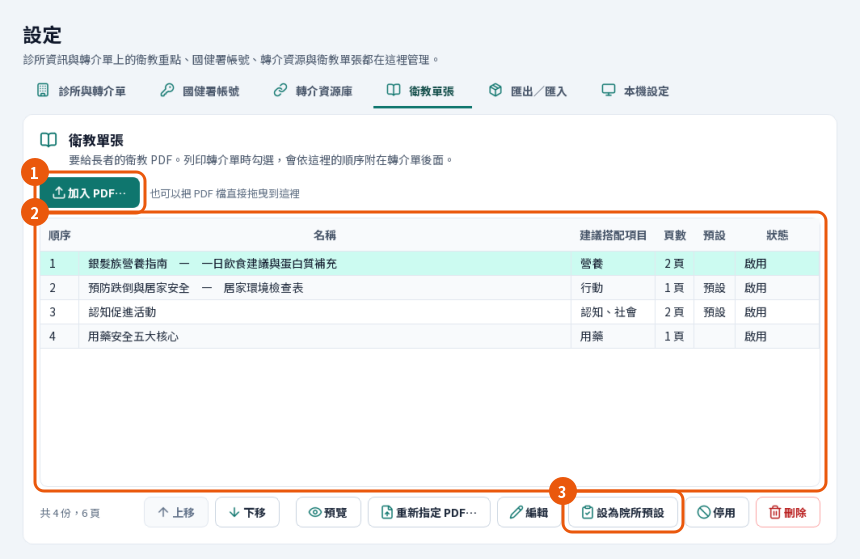

   *圖 13：① 加入 PDF…　② 選取單張　③ 設為院所預設。沒有勾選建議搭配項目的單張，設成院所預設也不會被帶入。*

### 匯入設定包

設定包是一個 zip 檔，裡面是轉介資源與衛教單張（含院所預設標記）。它不含帳號密碼、診所名稱電話地址這些設定與各項衛教重點；但資源的聯絡人與電話、PDF 裡印的院所名稱都在裡面，分享之前先看過內容。

1. 到 **設定 › 匯出／匯入**，按 **選擇設定包…**，選 zip 檔。

   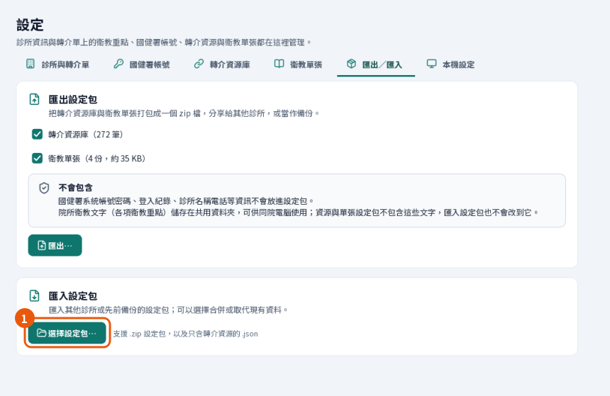

   *圖 14：① 選擇設定包…。上面的「匯出…」可以把自己的資源與單張做成設定包，備份或分享給其他院所。*

2. 選 **合併（建議）**：保留現有資料，只加入新的。名稱與地址都相同的資源、內容相同的 PDF 會略過（已經有的那一筆不會被更新）。
3. 按 **匯入**。以圖中的示範設定包為例，你會看到「匯入完成」與「轉介資源新增 4 筆（略過重複 1 筆）；衛教單張新增 2 份。」；實際數量依設定包與現有資料而定。

   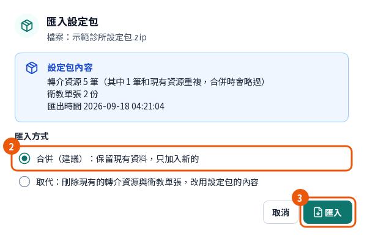

   *圖 15：② 合併（建議）　③ 匯入。圖中的設定包有 5 筆資源（1 筆和現有的重複）與 2 份單張。*

4. **確認院所預設**：到轉介資源庫與衛教單張看「預設」欄。設定包沒有標院所預設、或想用自己的安排時，選取後按「設為院所預設」（見上面兩節）。沒有院所預設的話，日常流程不會出現「帶入院所預設」按鈕。

> ⚠️ **注意**：「取代」會刪除現有的轉介資源，無法復原；設定包裡有衛教單張時，現有的單張也會一起刪除（沒有單張的設定包不會動到單張）。刪除範圍以視窗裡紅色警告寫的為準。要用取代之前，先按上面的「匯出…」備份。

> 🛠️ **小技巧**：想把院所自己整理的清單和 PDF 做成設定包，用 `tools/make_clinic_pack.py`（說明在檔案開頭）。院所的清單常有聯絡人姓名與手機，請放在 git 忽略的 `packs/`，不要放進會跟著程式發佈的 `examples/`。

### 國健署帳號

只有篩檢查詢需要。

1. 到 **設定 › 國健署帳號**，按 **設定帳號密碼**（設定過之後這顆按鈕會變成「修改帳號密碼」）。
2. 輸入 hpdcs 的帳號與密碼，按 **儲存並測試登入**。你會看到綠色的「登入成功」。
3. 按 **完成**。主畫面最下面的狀態列會顯示「國健署帳號 abc***（已登入）」。

   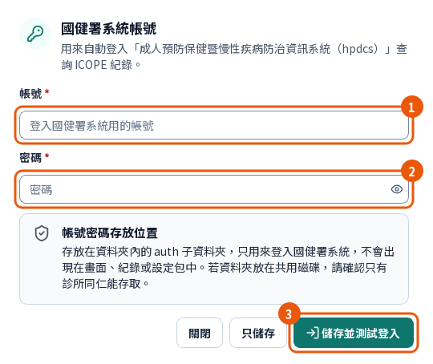

   *圖 16：① 帳號　② 密碼　③ 儲存並測試登入。密碼只存在資料夾的 auth 子資料夾，不會出現在畫面、紀錄或設定包。*

## 卡住了怎麼辦

| 症狀 | 怎麼處理 |
|---|---|
| 沒有「帶入院所預設」按鈕 | 看按鈕位置的那幾行字。「可在設定把常用的資源與單張設為「院所預設」…」：院所還沒設定，見[轉介資源與院所預設](#轉介資源與院所預設)。「○○目前沒有院所預設，可自行選擇」：這個項目沒有預設，按「下一步：選轉介資源」自己選。「已帶入過院所預設：…」：已經帶入了。 |
| 按了帶入卻顯示「沒有新增內容，原本就選好了」 | 預設的內容原本就選好了，直接按「確認與列印」。 |
| 上方出現「要改成 ○○ 的轉介單嗎？」 | 讀到另一位長者了，見[換下一位長者時](#快速開始印出第一份轉介衛教單)的三個選擇。不確定就選「清除，開始 ○○ 的轉介單」重新勾選，最不會混到上一位的內容。 |
| 顯示「列印失敗，這份轉介單還沒印出」 | 確認印表機後按「重試列印」，或先「另存 PDF…」。出現「已送出列印」卻沒有紙出來，請看印表機本身（缺紙、離線、工作卡在佇列）。 |
| 預覽的位置顯示「無法產生 PDF」 | 照訊息寫的原因處理。寫「○○」的衛教重點超過 200 字或 6 行：到「設定 › 診所與轉介單」把該項目的文字縮短後儲存，再回來列印。寫找不到衛教單張「○○」的檔案，或它的 PDF 無法讀取：回上一步取消勾選那份單張先印，再請管理者到「設定 › 衛教單張」選取訊息裡寫的那份單張，按「重新指定 PDF…」換上可以正常開啟的檔案。檔案不見的單張，狀態欄會寫「檔案遺失」；檔案還在但壞掉的，狀態欄看不出來，要照訊息裡的名稱找。 |
| 設定按了儲存卻沒有存 | 畫面會跳到有問題的欄位：診所名稱必填；衛教重點超過字數會顯示紅字。 |
| 只印衛教單張時顯示「沒有送出列印」「單張剛被更新，請再按一次列印。」 | 別台電腦剛更新、停用了單張，或調整了順序。確認勾選後再按一次列印。一直出現的話，一次只勾一份找出是哪一份單張，再請管理者到「設定 › 衛教單張」選取它，按「重新指定 PDF…」重新選一次檔案。 |
| 匯入設定包後同一個單位出現兩次 | 名稱或地址不同會被當成不同的資源。到轉介資源庫把不要的那一筆「停用」。 |
| 顯示「國健署系統登入失敗，已暫停自動登入」 | 帳號或密碼可能不正確，或帳號被停用。為避免帳號被鎖，程式不會一直重試；到「設定 › 國健署帳號」確認後重新儲存帳號密碼，就會恢復。 |
| 讀卡失敗 | 確認卡片插好、晶片朝上；HIS 正在讀卡時等幾秒再試。兩台讀卡機的電腦到「本機設定」指定健保卡機。 |
| 開啟時顯示「無法存取資料存放位置」 | 可能是網路磁碟（NAS）離線、共用資料夾的權限改變，或 USB 隨身碟沒插上。確認後按「重試」；不要按「改用其他資料夾…」另外建一份，否則會變成兩份資料。 |

## 下一步

- 安裝、多台電腦共用資料夾、更新與備份：[INSTALL.md](INSTALL.md)。
- 把院所的清單做成設定包：`tools/make_clinic_pack.py`。
- 設計取捨與資料格式：[DESIGN.md](DESIGN.md)。
